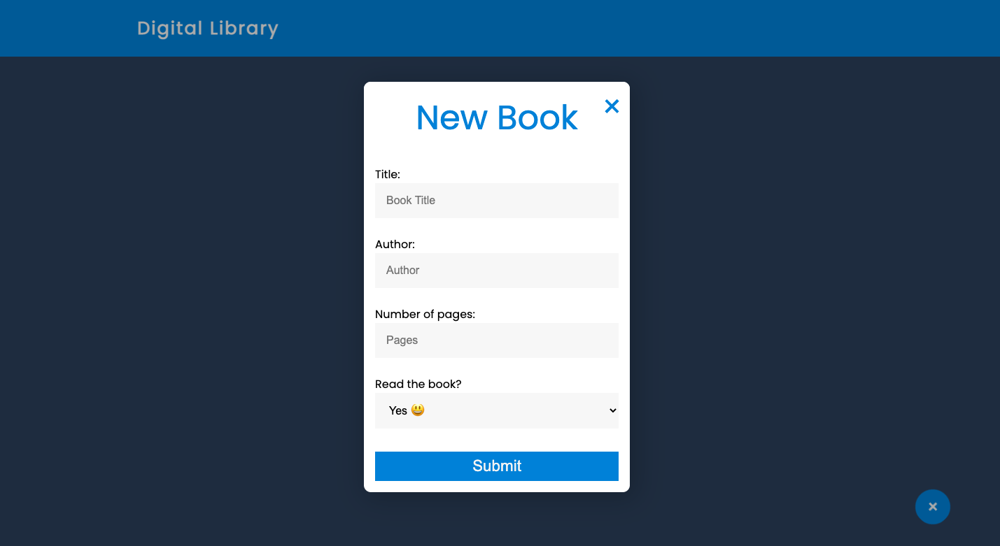
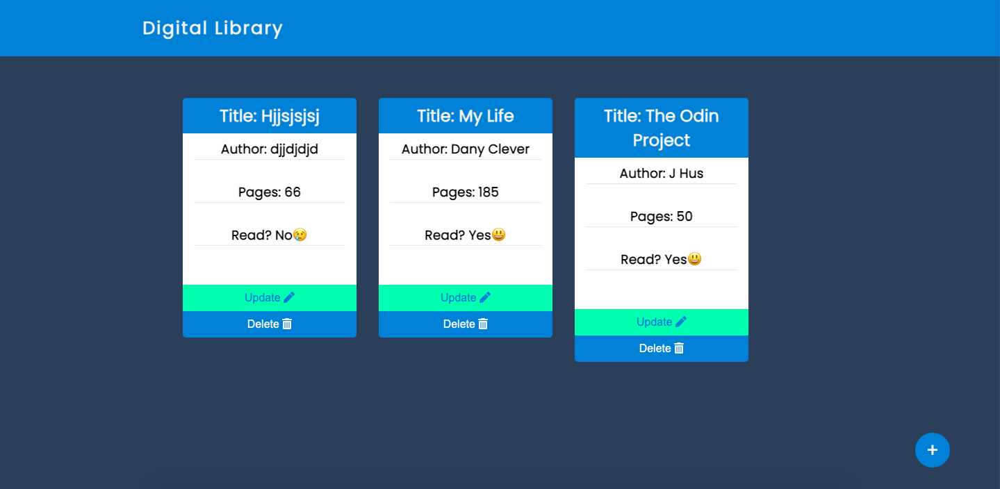

# Library_Store

> Building a book store library using vanilla Javascript. In this project, we demostrate the use of Object and Object Constructor.

## Features
The user can:
1. Add a book
2. Delete a book
3. Update(Change status from Read to Unread and vice versa)

The books are stored in browser's localStorage

## Screenshots







## Built With

- HTML
- CSS
- Javascript


## Getting Started

To get a local copy up and running follow these simple example steps.

1. ``` git clone https://github.com/dannyclever/Library_Store.git ```
2. Open the project with your favorite browser
3. Enjoy the beauty of the project


## Author

👤 **Author**

- Github: [dannyclever](https://github.com/dannyclever)
- Email: (danielnzinga5@gmail.com)


## The Website

Follow the link to acess to the Website live: https://dannyclever.github.io/Library_Store/


1. Fork it (https://github.com/dannyclever/Library_Store)
2. Create your feature branch (git checkout -b my-new-feature)
3. Commit your changes (git commit -m 'Add some feature')
4. Push to the branch (git push origin my-new-feature)
5. Create a new Pull Request

## Show your support

Give a ⭐️ if you like this project!

